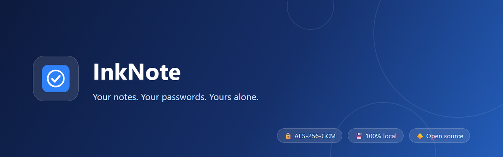
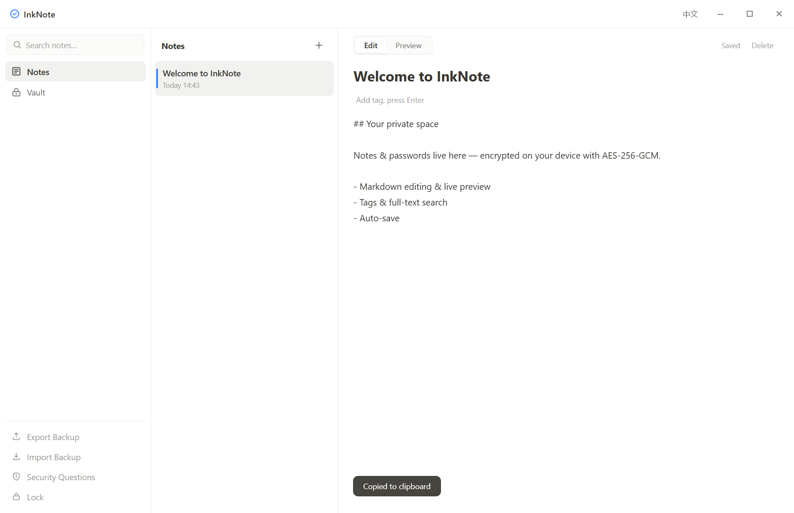
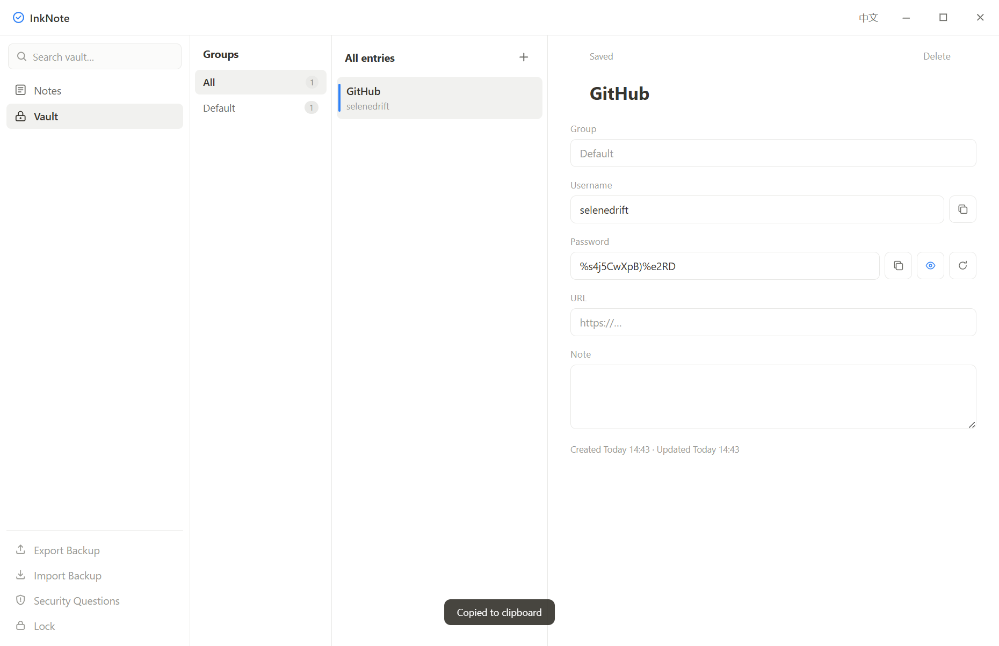
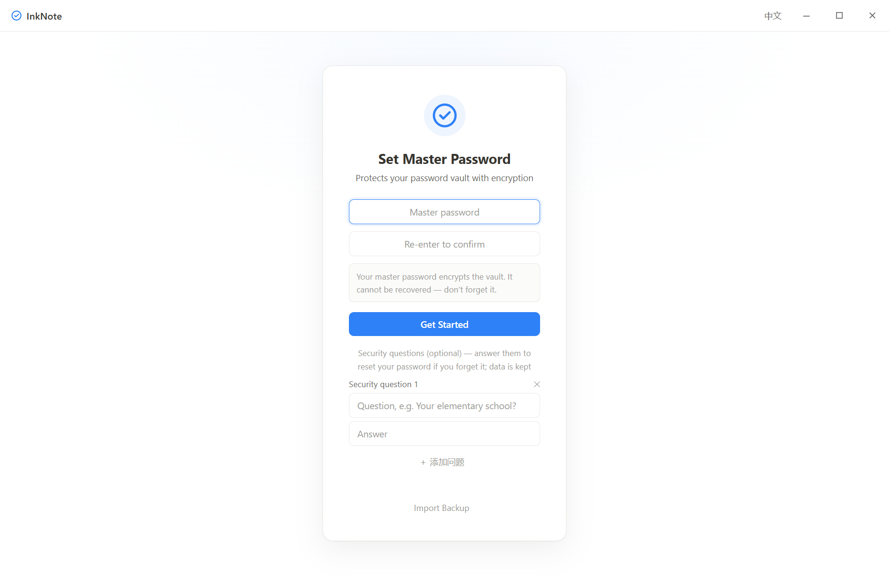

# InkNote

**English** | [简体中文](README.zh-CN.md)

<p align="center">
  
</p>

<p align="center">
  <a href="https://github.com/SeleneDrift/inknote/releases"></a>
  <a href="LICENSE"></a>
  
  
  <a href="https://github.com/SeleneDrift/inknote/stargazers"></a>
</p>

> **Your notes. Your passwords. Yours alone.**
>
> A local-first notes & password manager for Windows. Every byte you type is encrypted on your device with **AES-256-GCM** — no account, no cloud, no tracking.

## What if you never had to remember another password?

The AI era made a hard problem harder. You signed up for ChatGPT, Claude, Midjourney — every AI tool wants a new account, and every account wants a new password. Now add the old ones: email, banking, shopping, GitHub...

Most people genuinely remember only a few strong passwords. Everyone compromises — and every compromise has a price:

- **One password for everything** — one leaked site, and all your accounts fall like dominoes
- **Written on paper or in a memo app** — lose the list, lose everything
- **Let the browser remember** — gone when you switch browsers or computers; Chrome syncs them to Google's cloud
- **Hand your passwords to AI** — "help me organize my passwords" is a habit that's getting people hurt: everything you type into an AI tool gets read, stored and trained on
- **A paid cloud password manager** — $30+/year, and your vault still lives on someone else's server (LastPass lost 25 million users' vaults in 2022)

And your ideas? The AI era produces more of them than ever — prompts, drafts, half-formed thoughts. If you don't write one down in three seconds, it's gone. But opening a cloud note app means another login, another sync, another place your words get scanned.

**InkNote solves both, with one app:**

- **Passwords? Stop remembering them.** InkNote keeps them all — grouped, one-click copy, strong random generator. You memorize exactly one master password.
- **Ideas? Write them down in three seconds.** Open, type, done. Auto-saved, tagged, searchable.

And here's the part that matters: **none of it ever leaves your computer.** Everything is encrypted with AES-256-GCM. In an era where your data is worth more than ever, it stays where it started — with you. You don't need to trust us. You don't need to trust anyone.

**And it's open source.** The entire app is a few thousand lines of plain JavaScript with minimal dependencies — small enough for anyone (or any AI tool) to read end to end, audit every crypto call, and build on it. Don't like something? Change it. Want a feature we haven't built? Fork it — in the AI era, you don't have to wait for us.

## Why InkNote?

- 🔒 **Encrypted by design** — AES-256-GCM keys exist only in memory. Even your backup file is unreadable without your master password.
- 💾 **100% local & offline** — no account, no server, no telemetry. Nothing ever leaves your machine, and it works perfectly with no internet.
- 📝 **Notes that feel natural** — Markdown editing with live preview, tags, full-text search, and 400ms-debounced auto-save.
- 🔑 **A password manager in the same app** — groups, one-click copy, show/hide, and a strong random password generator.
- 🛡 **Never locked out** — set security questions and recover a forgotten master password without losing data.
- ♻️ **Backup & migrate freely** — one encrypted file exports everything; import it on any device, master password carries over.
- 🌏 **English & 中文 built-in** — switch anytime from the title bar, preference is remembered.
- 🧩 **Yours to extend** — fully open source, a few thousand lines of dependency-light JS. Audit it, fork it, or have an AI tool add features for you.

## Screenshots

| Notes | Vault | First-run setup |
|---|---|---|
|  |  |  |

## Quick Start

**Download** from [Releases](https://github.com/SeleneDrift/inknote/releases):

- `InkNote-<version>-setup.exe` — full installer (multi-language)
- `InkNote-<version>-portable.exe` — portable single file, run from a USB stick
- `InkNote-<version>.appx` — Windows package (unsigned, sideload only)

**Or build from source:**

```bash
npm install
npm start        # run the app
npm run dist     # build Windows installers → release/
```

> ⚠️ Release binaries are unsigned — SmartScreen may warn on first run (More info → Run anyway).

## For developers

**Tech stack:** Electron 43 · vanilla JS (no framework) · marked + DOMPurify · Node crypto (AES-256-GCM)

**Architecture highlights:**

- Keys live only in the main process memory — the renderer never sees them
- Strict CSP: no remote images, scripts or fonts; notes can't phone home
- Atomic writes (temp file + fsync + rename) — no corrupted files on crash
- Minimal dependencies, fully auditable source

**Build & test:**

```bash
npm install
npm start          # dev run
npm run dist       # NSIS installer + portable
npm run dist:store # Windows .appx (Store submission)
npm run verify     # end-to-end regression (needs debug port)
```

**Project layout:** `main.js` (main process: crypto & persistence) · `preload.js` (context bridge) · `renderer/` (UI) · `scripts/` (build, icon, e2e)

Contributions welcome — fork, fix, PR. Feature ideas live in [Issues](https://github.com/SeleneDrift/inknote/issues).

## How it protects you

- Your master password never leaves your device — the keys that decrypt your data are derived and kept in memory only
- Security-question answers use an independent salted derivation (don't pick answers that are easy to guess)
- Every write goes through temp-file + fsync + atomic rename — a crash or power loss can't truncate your data
- Copied passwords are wiped from the clipboard after 30 seconds
- The Markdown preview never loads remote images (CSP), so notes can't phone home

**Forget your master password?** Answer a security question to reset it — data stays intact. Without security questions set, the only way out is a full vault reset, which deletes all data.

## Backup & migration

Unlock → sidebar **Export backup** writes a single encrypted `.ink` file containing all notes and entries. On a new device, import it during first-time setup — master password and security questions carry over. On an existing device, import merges entries (newer wins per id).

## Feedback & support

Found a bug or want a feature? [Open an issue](https://github.com/SeleneDrift/inknote/issues).

## License

[ISC](LICENSE) © 2026 SeleneDrift
