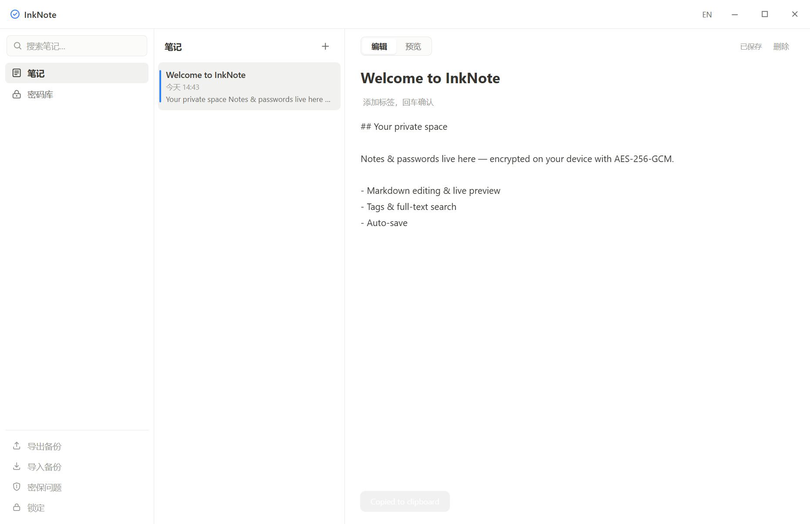
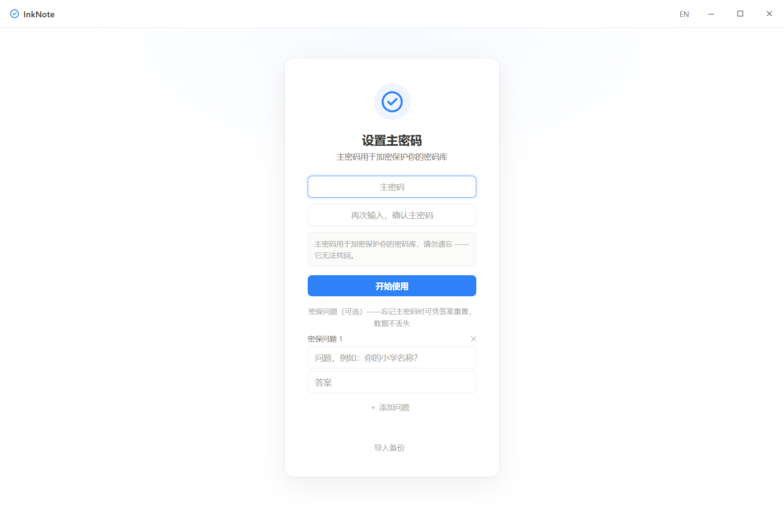

# InkNote

[English](README.md) | **简体中文**

<p align="center">
  
</p>

<p align="center">
  <a href="https://github.com/SeleneDrift/inknote/releases"></a>
  <a href="LICENSE"></a>
  
  
  <a href="https://github.com/SeleneDrift/inknote/stargazers"></a>
</p>

> **你的笔记，你的密码，只属于你。**
>
> 一款 Windows 本地优先的笔记与密码管理应用。你输入的每一个字节都在本机用 **AES-256-GCM** 加密——无账号、无云、无追踪。

## 为什么选择 InkNote？

- 🔒 **天生加密** —— AES-256-GCM，解密密钥只存在于内存。即使备份文件被拿走，没有主密码也读不出任何内容。
- 💾 **纯本地、可离线** —— 所有数据都在你的磁盘上。无账号、无服务器、无遥测，数据永不出本机。
- 📝 **顺手好用的笔记** —— Markdown 编辑与实时预览、标签、全文搜索、400ms 防抖自动保存。
- 🔑 **同一个应用里的密码库** —— 分组管理、一键复制、显示/隐藏、随机强密码生成器。
- 🛡 **永远不会被锁在门外** —— 设置密保问题后，忘记主密码也能凭答案找回，数据不丢失。
- ♻️ **自由备份与迁移** —— 一个加密文件导出全部内容；新设备一键导入，主密码与密保一并迁移。
- 🌏 **中英文双语** —— 标题栏一键切换，偏好自动保存。

## 界面预览

| 笔记 | 密码库 | 设置页 |
|---|---|---|
|  |  |  |

## 快速开始

从 [Releases](https://github.com/SeleneDrift/inknote/releases) 下载：

- `InkNote-<版本>-setup.exe` —— 完整安装包（多语言）
- `InkNote-<版本>-portable.exe` —— 免安装单文件版，U 盘即用
- `InkNote-<版本>.appx` —— Windows 应用包（未签名，仅限侧载）

**或从源码构建：**

```bash
npm install
npm start        # 运行
npm run dist     # 打包 Windows 安装包 → release/
```

> ⚠️ 安装包未签名 —— 首次运行 SmartScreen 可能提示"已保护你的电脑"（更多信息 → 仍要运行）。

## 它如何保护你

- 主密码永不出本机——解密数据的密钥在主进程内存中派生并只存在于内存
- 密保答案使用独立加盐派生（请勿设置容易猜到的答案）
- 所有写入均采用「临时文件 + fsync + 原子替换」——崩溃或断电不会截断数据
- 复制的密码 30 秒后自动从剪贴板清除
- Markdown 预览不加载远程图片（CSP 限制），笔记内容不会向外发送请求

**忘记主密码？** 答对任一密保问题即可重置主密码，数据保留。未设置密保问题时，只能"重置密码库"——这会删除全部数据。

## 备份与迁移

解锁后侧栏「导出备份」生成单个加密 `.ink` 文件，包含全部笔记与密码条目。新设备在首次设置页「导入备份」整体迁移，沿用原主密码与密保问题；已有数据的设备导入则按 id 合并（较新者胜）。

## 反馈与支持

发现 Bug 或有功能建议？[提交 Issue](https://github.com/SeleneDrift/inknote/issues)。

## License

[ISC](LICENSE) © 2026 SeleneDrift
